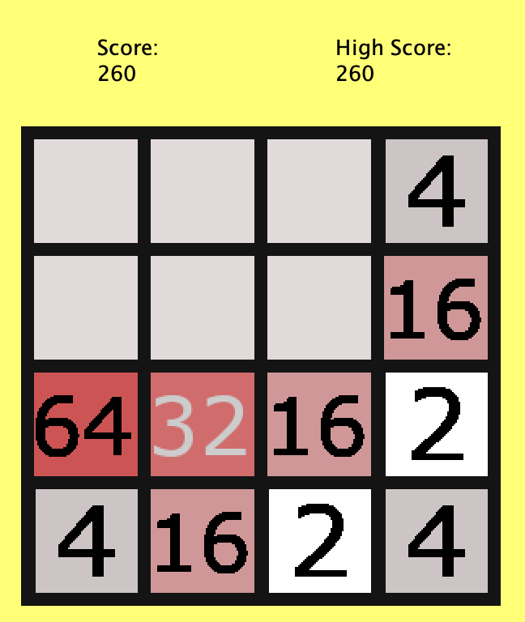

# Java 2048 Game

Welcome to 2048 in Java! I built this game as a side project while taking an introductory programming course in college.



This project taught me how to use arrays, functions and variables. Moreover, I learned how to build a basic GUI using java swing and awt.

I hope you enjoy playing around with it.

---

To get started, clone the project:

```
git clone git@github.com:luisalfonsopreciado/Java2048Game.git
```

Then compile and execute the main function located at Java2048.java.
